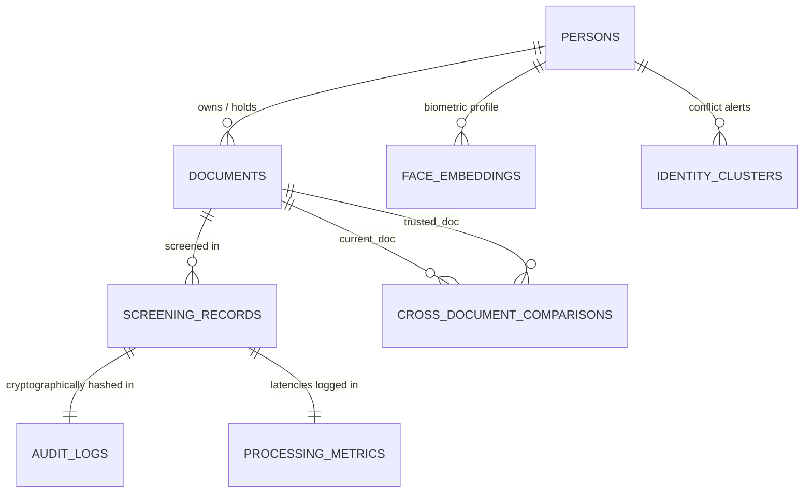

# DATABASE DESIGN PROPOSAL: MULTI-DOCUMENT IDENTITY RESOLUTION & CROSS-SCREENING
**Project:** AI-Based Fake Identity & Document Screening System (SIH PS-26188)  
**Backend Tech Stack:** SQLite 3, SQLAlchemy 2.0.30, FastAPI  
**Proposal Purpose:** Extend existing database models to support persistent identity profiles, multi-document cross-comparison, historical verification trust levels, and field-level contradiction evidence without over-engineering or breaking existing audit logs.  
**Design Policy:** Do NOT replace SQLite. Do NOT replace SQLAlchemy. Re-use and extend existing tables wherever possible. Do not store image binaries in DB (store evidence path & SHA-256 image hash).

---

## 1. ARCHITECTURAL EVALUATION OF EXISTING TABLES

### Can `screening_records` continue serving as the screening event table?
**YES.**  
`screening_records` is already well-structured as an immutable screening-event log (recording the exact input image, model outputs, OCR payload, 6-signal tampering results, face verification, risk score, and flags at that moment in time).

However, in the current design:
* A "Document" (e.g. an Aadhaar card or Passport) and an "Identity/Person" are implicitly lumped into individual screening rows.
* If a person uploads their Aadhaar card today and their Passport next week, there is no canonical `person_id` linking the two documents other than heuristic string matching on names and hashes in `registry_service.py`.
* There is no mechanism to track whether a historical document was confirmed **VERIFIED** by a border control officer, or whether it was merely an **UNVERIFIED** public upload.

### Minimal New Abstractions Needed:
To support canonical identity profiles, multiple documents per identity, and cross-document comparison with verification states, we only need **two new lightweight tables** and small non-breaking foreign key additions to `screening_records`:
1. `identities` (or `persons`): Canonical person profile holding trust status, verified core attributes (DOB, nationality, canonical name), and primary biometric link.
2. `documents`: Persistent entity representing a specific physical/legal identity document (e.g., Passport `Z1234567` issued to Person `P-001`), storing its verification status, issuing country, document type, and evidence file references.
3. `cross_document_comparisons`: Stores field-by-field comparisons (e.g., Current Passport DOB vs. Trusted Aadhaar DOB) generated during screening to provide transparent, explainable contradiction evidence for the Risk Engine.

---

## 2. DATA ENTITY RELATIONSHIPS



### Relationship Multiplicities:
1. **Person $\to$ Documents ($1 : N$):** One canonical identity profile can own multiple documents (e.g. 1 Passport, 1 National ID / Aadhaar, 1 Driving License).
2. **Document $\to$ Screening Records ($1 : N$):** A single physical document may be presented and screened multiple times over its validity lifetime (e.g. at departure, arrival, or renewal).
3. **Person $\to$ Face Embeddings ($1 : N$):** One person profile can have one or more registered 512-d biometric face embeddings from live selfies.
4. **Document $\to$ Cross-Document Comparisons ($1 : N$):** When a document is screened, fields extracted from it are compared against $1$ or more trusted historical documents belonging to the same candidate person.
5. **Screening Record $\to$ Audit Log ($1 : 1$):** Every screening execution produces exactly one cryptographically chained `AuditLog` row.
6. **Screening Record $\to$ Processing Metric ($1 : 1$):** Every screening execution produces exactly one millisecond-breakdown `ProcessingMetric` row.

---

## 3. VERIFICATION & TRUST LEVEL STATE MACHINE

To satisfy Requirement 10 (*"Unverified historical uploads must not automatically be treated as trusted ground truth"*), both `documents` and `persons` carry a `verification_status` state machine:

```
                  ┌────────────────┐
                  │   UNVERIFIED   │ (Default state on initial upload)
                  └───────┬────────┘
                          │
         ┌────────────────┼────────────────┐
         ▼                ▼                ▼
  ┌──────────────┐ ┌──────────────┐ ┌──────────────┐
  │   VERIFIED   │ │   FLAGGED    │ │   REJECTED   │
  └──────────────┘ └──────────────┘ └──────────────┘
```

* **`UNVERIFIED` (Default):** Document or identity screened by AI, but no border officer / authoritative authority has verified the ground truth. **Never used as an absolute baseline for cross-document conflict flags.**
* **`VERIFIED` (Trusted Baseline):** Verified by an authorized officer or matched against an authoritative government gateway (UIDAI, PRADO, INTERPOL). **Used as the trusted baseline for cross-document contradiction checks.**
* **`FLAGGED` (Suspicious):** Confirmed anomalies, tampering flags, or active duplicate identity conflicts exist.
* **`REJECTED` (Fraudulent / Revoked):** Confirmed fake, altered, stolen, or forged document. Immediate hard block.

---

## 4. COMPLETE SCHEMA SPECIFICATION

### Table 1: `persons` (NEW TABLE)
* **Purpose:** Canonical identity entity linking multiple travel/identity documents and biometrics to an individual.

| Column Name | SQLAlchemy Type | Constraints / Defaults | Indexed | Nullable | Description |
|---|---|---|---|---|---|
| `id` | `String(36)` | `primary_key=True`, default UUIDv4 | PK | No | Canonical person UUID |
| `primary_name` | `String(200)` | None | Yes | Yes | Best-known unmasked full name |
| `primary_name_hash` | `String(64)` | None | Yes | Yes | Blind HMAC-SHA256 hash for exact search |
| `date_of_birth` | `String(20)` | None | Yes | Yes | Primary DOB (`YYYY-MM-DD`) |
| `nationality` | `String(50)` | None | No | Yes | Country / nationality code |
| `gender` | `String(10)` | None | No | Yes | Gender |
| `verification_status`| `String(20)` | `default="UNVERIFIED"` | Yes | No | `UNVERIFIED`, `VERIFIED`, `FLAGGED`, `REJECTED` |
| `trust_score` | `Float` | `default=0.50` | No | No | $[0.0, 1.0]$ confidence rating in identity profile |
| `notes` | `Text` | None | No | Yes | Officer investigation remarks |
| `created_at` | `DateTime` | `default=datetime.utcnow` | Yes | No | Profile creation timestamp |
| `updated_at` | `DateTime` | `default=datetime.utcnow` | No | No | Profile update timestamp |

---

### Table 2: `documents` (NEW TABLE)
* **Purpose:** Persistent physical document entity. Tracks the identity document across multiple screenings, holding its trust tier and primary evidence links.

| Column Name | SQLAlchemy Type | Constraints / Defaults | Indexed | Nullable | Description |
|---|---|---|---|---|---|
| `id` | `String(36)` | `primary_key=True`, default UUIDv4 | PK | No | Canonical document UUID |
| `person_id` | `String(36)` | `ForeignKey("persons.id")` | Yes | Yes | Linked canonical person profile |
| `document_type` | `String(50)` | None | Yes | No | `passport`, `national_id`, `driving_license`, `visa`, `permit` |
| `document_number` | `String(100)` | None | Yes | Yes | Masked document number (`A123****`) |
| `document_number_encrypted` | `Text` | None | No | Yes | AES-128 Fernet encrypted document number |
| `document_number_hash` | `String(64)` | None | Yes | Yes | Blind HMAC-SHA256 hash for exact lookup |
| `issuing_country` | `String(50)` | None | No | Yes | Country of issuance (`IND`, `USA`, etc.) |
| `issue_date` | `String(20)` | None | No | Yes | Issue date string |
| `expiry_date` | `String(20)` | None | No | Yes | Expiry date string |
| `verification_status`| `String(20)` | `default="UNVERIFIED"` | Yes | No | `UNVERIFIED`, `VERIFIED`, `FLAGGED`, `REJECTED` |
| `primary_image_hash`| `String(64)` | None | Yes | Yes | SHA-256 of first-seen or highest-quality scan |
| `evidence_file_path`| `String(500)` | None | No | Yes | Local filesystem relative path to original image |
| `created_at` | `DateTime` | `default=datetime.utcnow` | Yes | No | Registered timestamp |
| `updated_at` | `DateTime` | `default=datetime.utcnow` | No | No | Update timestamp |

---

### Table 3: `screening_records` (MODIFIED EXISTING TABLE)
* **Status:** **RETAIN & EXTEND**.
* **Modifications:** Keep all 19 existing columns intact for full backward compatibility; add 3 optional foreign key / reference columns: `document_id`, `person_id`, and `evidence_file_path`.

| Column Name | SQLAlchemy Type | Constraints / Defaults | Indexed | Nullable | Description |
|---|---|---|---|---|---|
| `id` | `String(36)` | `primary_key=True` (UUIDv4) | PK | No | Screening event UUID |
| **`document_id`** | `String(36)` | `ForeignKey("documents.id")` | **Yes** | **Yes** | **[NEW] Link to persistent document entity** |
| **`person_id`** | `String(36)` | `ForeignKey("persons.id")` | **Yes** | **Yes** | **[NEW] Link to persistent person entity** |
| **`evidence_file_path`**| `String(500)` | None | **No** | **Yes** | **[NEW] Filesystem storage path of upload** |
| `document_type` | `String(50)` | `default="UNKNOWN"` | No | Yes | Classified document type |
| `document_number` | `String(100)` | None | Yes | Yes | Masked document number |
| `holder_name` | `String(200)` | None | Yes | Yes | Masked holder name |
| `date_of_birth` | `String(20)` | None | Yes | Yes | DOB extracted in this screening |
| `document_number_encrypted` | `Text` | None | No | Yes | Encrypted document number |
| `holder_name_encrypted` | `Text` | None | No | Yes | Encrypted holder name |
| `document_number_hash` | `String(64)` | None | Yes | Yes | HMAC-SHA256 index hash |
| `holder_name_hash` | `String(64)` | None | Yes | Yes | HMAC-SHA256 index hash |
| `image_hash` | `String(64)` | None | Yes | Yes | SHA-256 hash of this uploaded image |
| `extracted_fields` | `JSON` | None | No | Yes | **Remains JSON** (dynamic OCR fields) |
| `validation_result`| `JSON` | None | No | Yes | **Remains JSON** (rule check details) |
| `tampering_result` | `JSON` | None | No | Yes | **Remains JSON** (6-signal outputs & heatmaps) |
| `face_result` | `JSON` | None | No | Yes | **Remains JSON** (VGG-Face & liveness outputs) |
| `registry_result` | `JSON` | None | No | Yes | **Remains JSON** (blacklist & cross-doc matches) |
| `risk_score` | `Float` | `default=0.0` | No | No | Composite risk score $[0.0, 100.0]$ |
| `risk_label` | `String(20)` | `default="LOW"` | No | No | `LOW`, `MEDIUM`, `HIGH` |
| `flags` | `JSON` | None | No | Yes | Array of triggered risk flags |
| `created_at` | `DateTime` | `default=datetime.utcnow` | Yes | No | Timestamp of screening event |

---

### Table 4: `cross_document_comparisons` (NEW TABLE)
* **Purpose:** Field-level audit trail storing discrepancies between current OCR extractions and trusted historical records.

| Column Name | SQLAlchemy Type | Constraints / Defaults | Indexed | Nullable | Description |
|---|---|---|---|---|---|
| `id` | `String(36)` | `primary_key=True`, default UUIDv4 | PK | No | Comparison entry UUID |
| `screening_id` | `String(36)` | `ForeignKey("screening_records.id")`| Yes | No | Active screening execution |
| `person_id` | `String(36)` | `ForeignKey("persons.id")` | Yes | Yes | Subject person entity |
| `current_document_id` | `String(36)` | `ForeignKey("documents.id")` | Yes | No | Current document being screened |
| `trusted_document_id` | `String(36)` | `ForeignKey("documents.id")` | Yes | No | Prior trusted/verified document |
| `field_name` | `String(50)` | None | Yes | No | e.g., `date_of_birth`, `name`, `gender`, `nationality` |
| `current_value` | `String(255)` | None | No | Yes | Value extracted from current document |
| `trusted_value` | `String(255)` | None | No | Yes | Value recorded in trusted document |
| `current_confidence` | `Float` | None | No | Yes | OCR confidence of current field $[0.0, 1.0]$ |
| `trusted_confidence` | `Float` | None | No | Yes | OCR confidence of trusted field $[0.0, 1.0]$ |
| `is_match` | `Boolean` | None | Yes | No | `True` if values match; `False` if conflict |
| `severity` | `String(20)` | `default="MEDIUM"` | No | No | `LOW`, `MEDIUM`, `HIGH`, `CRITICAL` |
| `reason` | `String(255)` | None | No | Yes | Explanation (e.g., "DOB mismatch: 2000-01-01 vs 1998-06-15") |
| `risk_points_assigned` | `Float` | `default=0.0` | No | No | Risk contribution points added to risk engine |
| `created_at` | `DateTime` | `default=datetime.utcnow` | Yes | No | Comparison timestamp |

---

### Table 5: `face_embeddings` (EXISTING — KEEP)
* **Status:** **RETAIN AS-IS** with optional `person_id` loose coupling.
* **Columns:** `embedding_id` (PK), `person_id` (Indexed), `embedding_vector` (JSON), `embedding_hash` (Indexed), `created_at`.
* **Change:** No breaking schema modification needed; `person_id` can now optionally store the `persons.id` UUID.

### Table 6: `identity_clusters` (EXISTING — KEEP)
* **Status:** **RETAIN AS-IS**.
* **Columns:** `id` (PK), `person_id` (Indexed), `document_number` (Indexed), `holder_name`, `evidence` (JSON), `created_at`.

### Table 7: `blacklisted_documents` (EXISTING — KEEP)
* **Status:** **RETAIN AS-IS**.
* **Columns:** `id` (PK), `document_number` (Unique, Indexed), `reason`, `country`, `document_type`, `severity`, `status`, `added_at`.

### Table 8: `audit_logs` (EXISTING — KEEP)
* **Status:** **RETAIN AS-IS**.
* **Columns:** `id` (PK), `screening_id` (Indexed), `timestamp`, `officer`, `document_hash`, `document_type`, `risk`, `risk_score`, `risk_category`, `decision`, `modules` (JSON), `processing_time_ms`, `previous_hash`, `audit_hash` (Unique, Indexed), `audit_hash_version`, `created_at`.

### Table 9: `processing_metrics` (EXISTING — KEEP)
* **Status:** **RETAIN AS-IS**.
* **Columns:** `id` (PK), `screening_id` (Indexed), `timings` (JSON), `total_ms`, `created_at`.

---

## 5. COLUMNS: WHAT REMAINS JSON VS. WHAT BECOMES SQL COLUMNS

### Must Remain JSON (High variability, non-searchable raw outputs)
1. `screening_records.extracted_fields`: Contains variable, document-specific OCR dictionaries, character-level bounding boxes, and field-specific engines.
2. `screening_records.validation_result`: Contains array of all rule evaluations (`checks`: name, passed, severity, message, observed, expected).
3. `screening_records.tampering_result`: Contains 6 forensic detector outputs, bounding boxes, polygon contours, and heatmap paths.
4. `screening_records.face_result`: Contains distance, threshold, detector name, and challenge response metrics.
5. `screening_records.registry_result`: Contains complete nested match objects from duplicate/blacklist checks.
6. `face_embeddings.embedding_vector`: 512 float values.
7. `audit_logs.modules`: Dynamic execution status flags.
8. `processing_metrics.timings`: Millisecond dictionary.

### Must Be Dedicated SQL Columns with B-Tree Indexes (High query frequency, search filters, joins)
1. `document_number` & `document_number_hash` (Exact document searches and blacklist lookups).
2. `holder_name` & `holder_name_hash` (Person name searches and deduplication).
3. `date_of_birth` (DOB cross-checks and age plausibility).
4. `image_hash` (Duplicate file & replay attack prevention).
5. `verification_status` (Filtering trusted vs unverified historical records).
6. `risk_label` & `risk_score` (Dashboard triage and risk-level filtering).
7. `document_type` (Routing document-specific parsing).
8. `created_at` (Timeline queries and historical sorting).

---

## 6. END-TO-END SCREENING & CROSS-COMPARISON WORKFLOW

```
NEW DOCUMENT UPLOADED
  │
  ▼
1. INTAKE & OCR EXTRACTION
   - Image saved to secure disk storage (evidence/uploads/<sha256>.jpg).
   - image_hash = SHA-256(image bytes).
   - Run Quality Gate & Perspective Rectification.
   - Run classify_document() & extract_document_fields().
   - Extracted: doc_type, doc_number, name, dob, gender, nationality, expiry.
  │
  ▼
2. IDENTIFY CANDIDATE PERSON & DOCUMENT ENTITY
   - Query documents by document_number_hash == lookup_hash(doc_number).
   - Query persons by name_hash == lookup_hash(name) OR biometric face embedding match (cosine >= 0.90).
   - If match found:
       Attach existing person_id and document_id.
   - If not found:
       Create candidate Person (status = UNVERIFIED).
       Create candidate Document (status = UNVERIFIED, evidence_file_path).
  │
  ▼
3. RETRIEVE TRUSTED HISTORICAL DOCUMENTS
   - Query documents WHERE person_id == candidate_person_id AND verification_status == 'VERIFIED'.
   - If no 'VERIFIED' document exists:
       Check for 'UNVERIFIED' prior documents for INFORMATIONAL comparison only (severity = LOW, risk_points = 0).
  │
  ▼
4. FIELD-BY-FIELD CROSS-DOCUMENT COMPARISON
   - Compare DOB:
       Current: "2000-01-01" vs Trusted: "1998-06-15"
       => MISMATCH! Severity: HIGH, Reason: "DOB conflict with verified Passport"
   - Compare Name:
       Current: "Rajesh Kumar" vs Trusted: "Rajesh Kumar"
       => MATCH.
   - Compare Gender:
       Current: "M" vs Trusted: "M"
       => MATCH.
   - Generate staged CrossDocumentComparison records.
  │
  ▼
5. STANDARD SCREENING MODULES
   - Module 2: Cross-field rule validation (expiry > issue, MRZ check digit).
   - Module 3: 6-signal tampering analysis (ELA, photo boundary seam, copy-move, CNN).
   - Module 4: Face verification & temporal liveness against live selfie.
   - Module 6: Watchlist / Blacklist registry lookup.
  │
  ▼
6. RISK SCORING ENGINE V2 CONSOLIDATION
   - Base weights: Validation (0.25) + Tampering (0.35) + Face (0.25) + Registry (0.15).
   - Cross-Document Intake Contribution:
       If field mismatch is with a VERIFIED document:
           Add 30.0 risk points to final score.
           Flag: "SECURITY ANOMALY: Date of Birth differs from trusted government-verified record".
       If field mismatch is with an UNVERIFIED document:
           Add 5.0 risk points (Informational warning only).
  │
  ▼
7. ATOMIC COMMIT (SINGLE TRANSACTION)
   - Staged db.add(ScreeningRecord)
   - Staged db.add_all(CrossDocumentComparisons)
   - Staged db.add(AuditLog) with chained SHA-256 hash
   - Staged db.add(ProcessingMetric)
   - Execute db.commit().
```

---

## 7. CONCRETE EXAMPLE: AADHAAR $\to$ PASSPORT DOB MISMATCH

### Scenario:
1. **Historical Event (Day 1):** User uploaded an official Indian Passport (`Z9876543`). The document was verified by an immigration officer and set to `verification_status = "VERIFIED"` with DOB `1998-06-15`.
2. **Current Event (Day 15):** The same individual submits an Aadhaar card (`9999-8888-7777`) with DOB extracted as `2000-01-01`.

### Database State After the Day 15 Screening:

#### `persons` Record
```json
{
  "id": "p-1001-uuid",
  "primary_name": "Rajesh Kumar",
  "primary_name_hash": "e3b0c44298fc1c149afbf4c8996fb92427ae41e4649b934ca495991b7852b855",
  "date_of_birth": "1998-06-15",
  "nationality": "IND",
  "verification_status": "VERIFIED",
  "trust_score": 0.85
}
```

#### `documents` Records
* **Record 1 (Day 1 - Trusted):**
  ```json
  {
    "id": "doc-passport-001",
    "person_id": "p-1001-uuid",
    "document_type": "passport",
    "document_number": "Z987****",
    "document_number_hash": "a1b2c3d4...",
    "issuing_country": "IND",
    "verification_status": "VERIFIED",
    "primary_image_hash": "9f86d081884c7d659a2feaa0c55ad015a3bf4f1b2b0b822cd15d6c15b0f00a08",
    "evidence_file_path": "evidence/uploads/passport_scan_verified.jpg"
  }
  ```
* **Record 2 (Day 15 - Current):**
  ```json
  {
    "id": "doc-aadhaar-002",
    "person_id": "p-1001-uuid",
    "document_type": "national_id",
    "document_number": "9999********",
    "document_number_hash": "f5e4d3c2...",
    "issuing_country": "IND",
    "verification_status": "UNVERIFIED",
    "primary_image_hash": "4b227777d4dd1fc61c6f884f48641d02b4d121d3fd328cb08b5531fcacdabf8a",
    "evidence_file_path": "evidence/uploads/aadhaar_upload_raw.jpg"
  }
  ```

#### `cross_document_comparisons` Record
```json
{
  "id": "comp-7788-uuid",
  "screening_id": "scr-20260902-uuid",
  "person_id": "p-1001-uuid",
  "current_document_id": "doc-aadhaar-002",
  "trusted_document_id": "doc-passport-001",
  "field_name": "date_of_birth",
  "current_value": "2000-01-01",
  "trusted_value": "1998-06-15",
  "current_confidence": 0.94,
  "trusted_confidence": 0.99,
  "is_match": false,
  "severity": "HIGH",
  "reason": "Extracted Date of Birth '2000-01-01' conflicts with verified historical Passport '1998-06-15'",
  "risk_points_assigned": 30.0
}
```

#### Resulting `screening_records` Row
* **`id`:** `scr-20260902-uuid`
* **`document_id`:** `doc-aadhaar-002`
* **`person_id`:** `p-1001-uuid`
* **`risk_score`:** `68.50` (Pushed into `HIGH` risk due to $+30.0$ cross-document penalty)
* **`risk_label`:** `HIGH`
* **`flags`:**
  ```json
  [
    "POTENTIAL IDENTITY CONFLICT: Date of Birth differs from trusted government-verified Passport (2000-01-01 vs 1998-06-15)"
  ]
  ```
* **Decision:** `HOLD` (Manual investigation by officer required).

---

## 8. SUMMARY MATRIX: WHAT TO KEEP, MODIFY, AND ADD

### 1. CURRENT SCHEMA — KEEP
* `blacklisted_documents`: Complete table preserved.
* `face_embeddings`: Complete table preserved.
* `identity_clusters`: Complete table preserved.
* `audit_logs`: Complete table preserved (hash-chaining logic untouched).
* `processing_metrics`: Complete table preserved.

### 2. CURRENT SCHEMA — MODIFY
* `screening_records`:
  * Add column: `document_id VARCHAR(36) REFERENCES documents(id)` (nullable).
  * Add column: `person_id VARCHAR(36) REFERENCES persons(id)` (nullable).
  * Add column: `evidence_file_path VARCHAR(500)` (nullable).
  * Existing 19 columns and all JSON structures remain completely unchanged.

### 3. NEW TABLES — IF NEEDED
* `persons`: Stores canonical identity profiles and trust ratings.
* `documents`: Stores persistent document identities, verification status, and evidence paths.
* `cross_document_comparisons`: Stores field-level comparison results between documents.

### 4. NEW COLUMNS — IF NEEDED
* `screening_records.document_id`
* `screening_records.person_id`
* `screening_records.evidence_file_path`

### 5. COLUMNS THAT SHOULD NOT BE DUPLICATED
* Do **NOT** duplicate `validation_result`, `tampering_result`, or `extracted_fields` into separate normalized tables. Keep them in `screening_records` as JSON blobs.
* Do **NOT** store image raw binary blobs in any database column. Store only `evidence_file_path` and `image_hash`.

### 6. REQUIRED FOREIGN KEYS
* `documents.person_id` $\to$ `persons.id`
* `screening_records.document_id` $\to$ `documents.id`
* `screening_records.person_id` $\to$ `persons.id`
* `cross_document_comparisons.screening_id` $\to$ `screening_records.id`
* `cross_document_comparisons.person_id` $\to$ `persons.id`
* `cross_document_comparisons.current_document_id` $\to$ `documents.id`
* `cross_document_comparisons.trusted_document_id` $\to$ `documents.id`

### 7. REQUIRED INDEXES
* `persons(primary_name_hash)`
* `persons(verification_status)`
* `documents(document_number_hash)`
* `documents(person_id)`
* `documents(verification_status)`
* `screening_records(document_id)`
* `screening_records(person_id)`
* `cross_document_comparisons(screening_id)`
* `cross_document_comparisons(current_document_id)`
* `cross_document_comparisons(trusted_document_id)`

---

## 9. DATABASE MIGRATION PLAN (SQLITE COMPATIBLE)

SQLite does not support complex `ALTER TABLE` operations, but adding nullable columns is fully supported via standard `ALTER TABLE ADD COLUMN`.

```sql
-- Step 1: Create persons table
CREATE TABLE IF NOT EXISTS persons (
    id VARCHAR(36) PRIMARY KEY,
    primary_name VARCHAR(200),
    primary_name_hash VARCHAR(64),
    date_of_birth VARCHAR(20),
    nationality VARCHAR(50),
    gender VARCHAR(10),
    verification_status VARCHAR(20) NOT NULL DEFAULT 'UNVERIFIED',
    trust_score FLOAT NOT NULL DEFAULT 0.50,
    notes TEXT,
    created_at DATETIME DEFAULT CURRENT_TIMESTAMP,
    updated_at DATETIME DEFAULT CURRENT_TIMESTAMP
);
CREATE INDEX IF NOT EXISTS ix_persons_primary_name_hash ON persons(primary_name_hash);
CREATE INDEX IF NOT EXISTS ix_persons_verification_status ON persons(verification_status);

-- Step 2: Create documents table
CREATE TABLE IF NOT EXISTS documents (
    id VARCHAR(36) PRIMARY KEY,
    person_id VARCHAR(36),
    document_type VARCHAR(50) NOT NULL,
    document_number VARCHAR(100),
    document_number_encrypted TEXT,
    document_number_hash VARCHAR(64),
    issuing_country VARCHAR(50),
    issue_date VARCHAR(20),
    expiry_date VARCHAR(20),
    verification_status VARCHAR(20) NOT NULL DEFAULT 'UNVERIFIED',
    primary_image_hash VARCHAR(64),
    evidence_file_path VARCHAR(500),
    created_at DATETIME DEFAULT CURRENT_TIMESTAMP,
    updated_at DATETIME DEFAULT CURRENT_TIMESTAMP,
    FOREIGN KEY (person_id) REFERENCES persons(id)
);
CREATE INDEX IF NOT EXISTS ix_documents_person_id ON documents(person_id);
CREATE INDEX IF NOT EXISTS ix_documents_document_number_hash ON documents(document_number_hash);
CREATE INDEX IF NOT EXISTS ix_documents_verification_status ON documents(verification_status);

-- Step 3: Extend screening_records (Forward migration)
ALTER TABLE screening_records ADD COLUMN document_id VARCHAR(36);
ALTER TABLE screening_records ADD COLUMN person_id VARCHAR(36);
ALTER TABLE screening_records ADD COLUMN evidence_file_path VARCHAR(500);
CREATE INDEX IF NOT EXISTS ix_screening_records_document_id ON screening_records(document_id);
CREATE INDEX IF NOT EXISTS ix_screening_records_person_id ON screening_records(person_id);

-- Step 4: Create cross_document_comparisons table
CREATE TABLE IF NOT EXISTS cross_document_comparisons (
    id VARCHAR(36) PRIMARY KEY,
    screening_id VARCHAR(36) NOT NULL,
    person_id VARCHAR(36),
    current_document_id VARCHAR(36) NOT NULL,
    trusted_document_id VARCHAR(36) NOT NULL,
    field_name VARCHAR(50) NOT NULL,
    current_value VARCHAR(255),
    trusted_value VARCHAR(255),
    current_confidence FLOAT,
    trusted_confidence FLOAT,
    is_match BOOLEAN NOT NULL,
    severity VARCHAR(20) NOT NULL DEFAULT 'MEDIUM',
    reason VARCHAR(255),
    risk_points_assigned FLOAT NOT NULL DEFAULT 0.0,
    created_at DATETIME DEFAULT CURRENT_TIMESTAMP,
    FOREIGN KEY (screening_id) REFERENCES screening_records(id),
    FOREIGN KEY (person_id) REFERENCES persons(id),
    FOREIGN KEY (current_document_id) REFERENCES documents(id),
    FOREIGN KEY (trusted_document_id) REFERENCES documents(id)
);
CREATE INDEX IF NOT EXISTS ix_cross_comparisons_screening_id ON cross_document_comparisons(screening_id);
CREATE INDEX IF NOT EXISTS ix_cross_comparisons_current_doc ON cross_document_comparisons(current_document_id);
CREATE INDEX IF NOT EXISTS ix_cross_comparisons_trusted_doc ON cross_document_comparisons(trusted_document_id);
```

---

## 10. REQUIRED SERVICE & API CHANGES

1. **`app/services/identity_resolution_service.py` (New Service):**
   * Encapsulates candidate matching: takes extracted OCR name/hash, document number/hash, and face embedding, queries `persons` and `documents`, and returns the canonical `person_id`.
2. **`app/services/cross_document_service.py` (New Service):**
   * Takes extracted fields from current OCR and compares them against `documents WHERE person_id == X AND verification_status == 'VERIFIED'`.
   * Evaluates date format differences, names (using Levenshtein / token sort ratio), and gender.
   * Emits structured `ComparisonResult` dictionaries for the Risk Engine.
3. **`app/services/risk_engine.py` (Minimal Extension):**
   * Add `cross_document_result: Optional[List[Dict[str, Any]]] = None` parameter to `compute_risk_score()`.
   * If a conflict with a `VERIFIED` document exists, apply configurable risk points (e.g. $+30.0$ for DOB conflict, $+20.0$ for Name conflict).
4. **`app/api/risk_score_routes.py` (`assess()`):**
   * Save uploaded file to `backend/dataset/evidence/uploads/<sha256>.jpg`.
   * Resolve `person_id` and `document_id`.
   * Run cross-document comparison prior to risk calculation.
   * Commit `ScreeningRecord`, `CrossDocumentComparison` records, `AuditLog`, and `ProcessingMetric` in the existing atomic transaction.
5. **New Verification Endpoints (`app/api/operations_routes.py`):**
   * `POST /api/documents/{id}/verify` (Sets status to `VERIFIED` or `REJECTED` by authorized officers).
   * `GET /api/persons/{id}/documents` (Retrieves all documents associated with a person).
   * `GET /api/documents/{id}/history` (Retrieves all screenings of a specific document).
